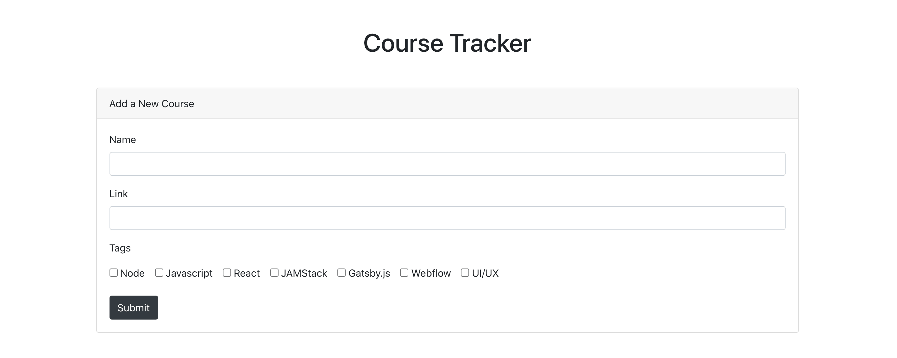
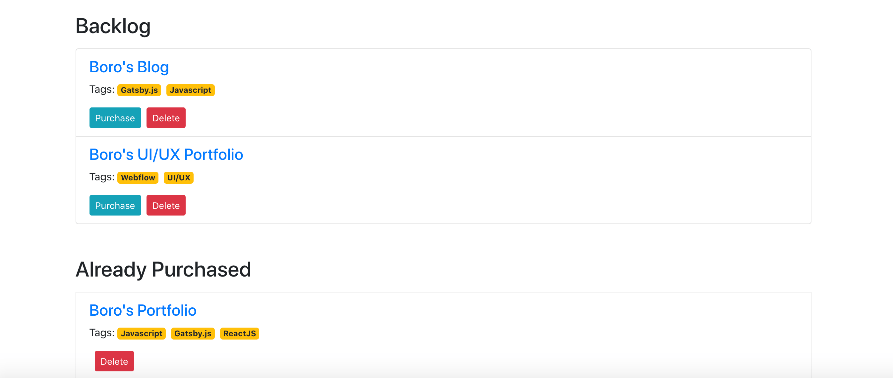

## Application Screens

## Before starting the application?

Make sure to create a .env file and include the following credentials from Airtable.

**AIRTABLE_API_KEY** = "YOUR AIRTABLE API KEY"  
**AIRTABLE_BASE_ID** = "YOUR AIRTABLE BASE ID"  
**AIRTABLE_TABLE_NAME** = "TABLE NAME"  

## Before starting the application?

1. Clone the repo in the local repository.
2. Type `npm install` on your terminal.
3. Type `netlify dev` to start the server with serverless functions running on PORT:8888.
